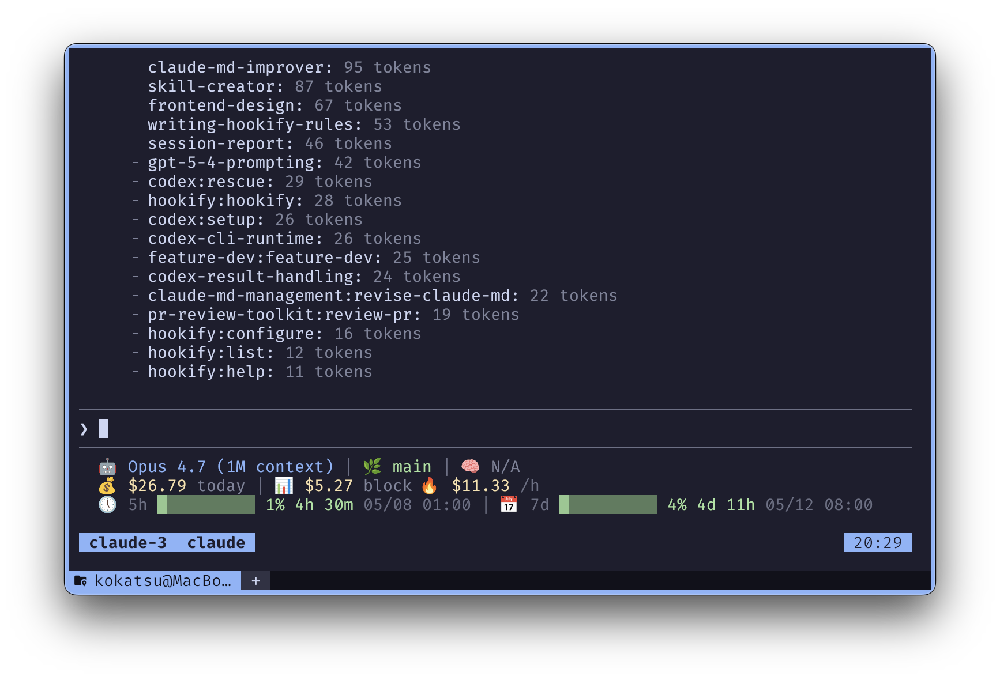

# cc-statusline

A fast statusline for [Claude Code](https://docs.anthropic.com/en/docs/claude-code) that displays model info, context usage, cost tracking, and burn rate. Written in Zig for minimal latency.



## Features

- **Model & Context** — Current model name, reasoning effort level (⚡, tinted per level like Claude Code's `/effort` slider — theme-aware, with a rainbow gradient for `max`), git branch, context window usage with color-coded progress bar (green → yellow → red) and token counts (`126k/200k`)
- **Session Name** — Shows custom session name (📛) set via `--name` or `/rename` (opt-in via `CC_STATUSLINE_SHOW_SESSION=1`)
- **Subagent Indicator** — Shows current subagent name (🧩) when running inside a Claude Code subagent
- **200K+ Tier Alert** — 🚨 marker when the conversation has exceeded the 200K-token pricing tier
- **Cost Tracking** — Today's total cost, current block cost (5h window), burn rate per hour (opt-out via `CC_STATUSLINE_SHOW_COST=0`)
- **Rate Limits** — 5-hour and 7-day usage percentage with color-coded progress bars and reset countdown
- **Prompt Cache** — Warm/cold state with a TTL-relative countdown (💾), cache hit ratio (🎯), and the dollar cost of re-caching if the prefix goes cold (💸), priced from the model's cache-write rate (opt-in via `CC_STATUSLINE_SHOW_CACHE=1`)
- **Smart Caching** — Two-tier binary cache (30s result TTL, 5m file list TTL) with incremental diff parsing for near-zero overhead
- **Pricing** — Supports Fable 5.1/5, Mythos 5.1/5, Opus 5/4.8/4.7/4.6/4.5/4.1/4/3, Sonnet 5/4.6/4.5/4/3.7/3.5, Haiku 4.5/3.5 (including 200K+ tiered pricing and per-model fast mode rates)
- **Theming** — Built-in Catppuccin Mocha theme, fully customizable via environment variables

## Requirements

- Zig 0.16.0+

## Build

```sh
zig build -Doptimize=ReleaseFast
```

The binary is output to `zig-out/bin/cc-statusline`.

## Usage

cc-statusline reads Claude Code's statusline JSON from stdin and outputs ANSI-colored status (2-4 lines depending on available data):

```text
🤖 Fable ⚡xhigh | 📛 my-session | 🌿 main | 🧠 ██████▓░░░ 63% 126k/200k
💰 $26.79 today | 📊 $5.27 block 🔥 $11.33 /h
💾 warm 41m | 🎯 █████████▓ 91% | 💸 $0.45
🕔 5h ████▓░░░░░ 42% 1h 30m 05/08 01:00 | 📅 7d ░░░░░░░░░░ 4% 4d 11h 05/12 08:00
```

[`schema.json`](./schema.json) is a sample of that stdin payload, recording the format defined by
Claude Code's [status line reference](https://code.claude.com/docs/en/statusline). The field names
and structure are the ones Claude Code sends; the values are this project's own.

### Claude Code Integration

Add to `~/.claude/settings.json`:

```json
{
  "statusline": {
    "command": "/path/to/cc-statusline"
  }
}
```

## Configuration

### Theme

Set `CC_STATUSLINE_THEME` to use a built-in theme:

```sh
export CC_STATUSLINE_THEME=catppuccin-mocha
```

### Color Overrides

Override individual colors with ANSI escape sequences:

| Variable | Description | Default |
|---|---|---|
| `CC_STATUSLINE_COLOR_MODEL` | Model name color | Cyan |
| `CC_STATUSLINE_COLOR_AGENT` | Subagent name color | Magenta |
| `CC_STATUSLINE_COLOR_GREEN` | Low context usage | Green |
| `CC_STATUSLINE_COLOR_YELLOW` | Medium context usage | Yellow |
| `CC_STATUSLINE_COLOR_RED` | High context usage | Red |
| `CC_STATUSLINE_COLOR_DIM` | Separators and labels | Dim |
| `CC_STATUSLINE_BAR_FILLED` | Filled bar character | `█` |
| `CC_STATUSLINE_BAR_TRANSITION` | Transition bar character | `▓` |
| `CC_STATUSLINE_BAR_EMPTY` | Empty bar character | `░` |

### Bar Width

Set `CC_STATUSLINE_BAR_WIDTH` to shrink the progress bars or hide them entirely:

```sh
export CC_STATUSLINE_BAR_WIDTH=0
```

The value caps the width derived from the terminal width (`COLUMNS`), so it can only shrink the bars — `0` hides the context bar, the rate-limit bars, and the cache hit-ratio bar.

### Session Name

The session name segment (📛) is hidden by default. Set `CC_STATUSLINE_SHOW_SESSION=1` to show it:

```sh
export CC_STATUSLINE_SHOW_SESSION=1
```

### Prompt Cache

The prompt cache line (💾) is hidden by default. Set `CC_STATUSLINE_SHOW_CACHE=1` to show it:

```sh
export CC_STATUSLINE_SHOW_CACHE=1
```

It renders once Claude Code sends a `prompt_cache` object reporting `caching_observed: true`. The
object needs Claude Code v2.1.251 or later and appears after the main conversation's first API
response; `caching_observed` stays false while prompt caching is off or the provider doesn't report
it, and the line stays hidden then. It is also dropped below 39 columns, where it no longer fits.

The 💸 amount is what the next request would spend re-writing the cache if the prefix goes cold
first — `recache_tokens_if_cold` at the model's cache-write rate for the active TTL. Like every
other cost here it is a list-price estimate.

### Cost Line

The cost line (💰) is shown by default. Set `CC_STATUSLINE_SHOW_COST=0` to hide it, for example
when another widget already shows the same number:

```sh
export CC_STATUSLINE_SHOW_COST=0
```

Hiding the line does not skip the transcript scan. The scan runs on every invocation so the shared
cache keeps a `block` computed from Claude Code's real 5-hour reset window, which only a call with a
session JSON on stdin can supply.

### Standalone Use (Empty Stdin)

When nothing is piped to stdin, cc-statusline emits exactly one line: the cost line. The model and
context line is dropped because it would only ever read `Unknown | N/A`, and `CC_STATUSLINE_SHOW_COST`
is ignored so the output is never empty. This is the contract for status bars that run the binary
themselves, such as a tmux status-bar command:

```sh
cc-statusline </dev/null
# 💰 $2.16 today | 📊 $2.16 block 🔥 $12.36 /h
```

Malformed JSON on stdin still produces both lines, so a broken pipeline is visible as `Unknown`. A
failed stdin read is treated as empty input.

### Config Directory

By default, cc-statusline reads from `~/.claude`. Override with:

```sh
export CLAUDE_CONFIG_DIR=/path/to/config
```

## Test

```sh
zig build test
```

## Benchmark

```sh
zig build bench -Doptimize=ReleaseFast
```

Generates synthetic JSONL transcripts at `/tmp/cc-statusline-bench/` (small / medium / large) and reports min / median / p99 for four scenarios:

| scenario              | what it measures                                         |
|-----------------------|----------------------------------------------------------|
| `end-to-end (cold)`   | spawning the binary with the cache file deleted          |
| `end-to-end (warm)`   | spawning with a hot 30s result cache                     |
| `fullScan`            | `scan.benchFullScan` only (parses every JSONL)           |
| `parseJsonlContent`   | the JSONL parser on a single fixture file                |

Child processes run with `CLAUDE_CONFIG_DIR=/tmp/cc-statusline-bench`, so the harness never touches the user's real config dir, cache, or live statusline output.

Useful flags (pass after `--`):

```sh
zig build bench -Doptimize=ReleaseFast -- --save             # record bench/baseline.json
zig build bench -Doptimize=ReleaseFast -- --size=medium      # run only one fixture size
```

When `bench/baseline.json` exists, each row is annotated with its delta vs. the recorded median.

## Acknowledgments

- The transcript scanning logic (5-hour block detection, message+request ID
  deduplication, JSONL field mapping) is derived from
  [ccusage](https://github.com/ryoppippi/ccusage) by @ryoppippi (MIT).
- The `catppuccin-*` themes use color values from the
  [Catppuccin](https://github.com/catppuccin/catppuccin) palette (MIT).

See [LICENSE](./LICENSE) for full third-party copyright notices.
